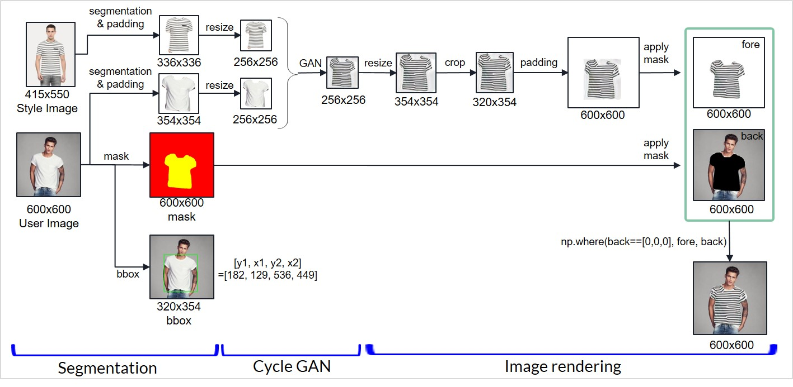

# 전체 프로세스 통합 및 이미지 합성
이 글에서는 Segmentation, GAN의 각 과정에 대해 언급하지 않고 아웃풋과 사진 합성 중심으로 기술한다.


## 1. Segmentation (Mask R-CNN)
쇼핑몰 사진(줄무늬 티셔츠) 에서는 (a)세그멘테이션된 줄무늬 옷 이미지만 추출된다.

유저 사진(흰 티셔츠)에서는 (b)세그멘테이션된 흰 옷 이미지, (c)바이너리 마스크, (d)바운딩박스 좌표가 추출된다.

(a) 와 (b)의 이미지 크기는 Mask R-CNN에서 감지한 bbox 사이즈와 일치한다.


## 2. padding & resize
(a) (b)는 바운딩 박스(bbox)에 따라 대부분 직사각형 모양으로 추출된다.

(a) (b)는 CycleGAN의 인풋으로 들어가야 하는데, CycleGAN 인풋은 항상 256x256(정사각형)이다.

따라서 먼저 (a) (b)에 흰색으로 padding을 주어 정사각형 모양으로 만든다.

이때, padding은 가로 세로 중 긴 폭을 기준으로 준다.

예를 들어, 위 사진에서 (b)는 원래 bbox 좌표에 의해 320x354 이기 때문에 가로에 각 17픽셀씩 padding을 준다.

이 과정을 거쳐 (a)는 336x336 , (b)는 354x354으로, 둘다 정사각형이 되었다.

그리고나서 둘다 256x256으로 resize 해준다.

(이미지 비율을 무시하고 resize되는 것을 방지하기 위해 먼저 정사각형이 되게 패딩을 해주고 256x256으로 리사이즈해주는 것)


## 3. Cycle GAN
padding & resize를 거친 (a), (b)를 CycleGAN에 인풋으로 넣으면, (b) shape에 (a) style이 입혀진 256x256 사이즈의 아웃풋이 나온다.

이제 이 아웃풋을 유저 이미지에 입히기 위해 다시 resize, crop, padding, masking 과정을 거칠 것이다.

CycleGAN에서 생성된 아웃풋을 (e)라고 하겠다.

(e)는 최종적으로 유저 이미지에 입혀져야 하므로,

(e)가 정확히 유저 이미지의 티셔츠 좌표에 들어가게 할 것이다.


## 4. resize
먼저 (e)를 resize한다. 이때, (d)유저 이미지 bbox의 큰 폭을 기준으로 하여 이미지를 키운다.


## 5. crop
2의 padding 과정에서 (b)에 양옆 17픽셀씩 패딩을 주었으므로, (e)에서는 양옆 17픽셀씩을 crop한다.


## 6. padding
(d)유저 이미지의 bbox 좌표 정보를 활용하여, 원본 유저 이미지의 크기가 되도록 padding을 준다. 

위 사진에서는 600x600이 되도록 패딩을 주었으며, 아래 크기만큼 각 위치에 패딩을 넣었다.
```
top = bbox의 y1 (=182)
bottom = 600 - bbox의 y2 (=536)
left = bbox의 x1 (=129)
right = 600 - bbox의 x2 (449)
```
이 결과 이미지를 (f)라고 하겠다.


## 7. apply mask
(c) 마스크를 원본 유저 이미지에 적용하여 background를 추출한다. 이때, 티셔츠 부분의 값은 `RGB = [0,0,0]`이 된다.

(c) 마스크를 (f)에 적용하여 foreground를 추출한다. 배경 부분의 값은 무엇이든 상관 없다. 사실 foreground 추출은 굳이 필요 없는 부분이지만 시각화를 위해 넣었다.


## 8. 이미지 합성
`np.where(back==[0,0,0], fore, back)` 을 하여, background 이미지의 좌표값이 `[0,0,0]`인 픽셀은 foreground의 픽셀값으로 대체하고, 나머지는 background 값으로 넣는다. 이로써 합성이 완료된다.


## 9. 코드
`main.py`와 `Tshirt_v5.py`를 보면 된다.<br><br><br>
------------------
Copyright (c) 2019 Seoyoon Park<br>
Licensed under the MIT License (see LICENSE for details)<br>
Written by Seoyoon Park<br>